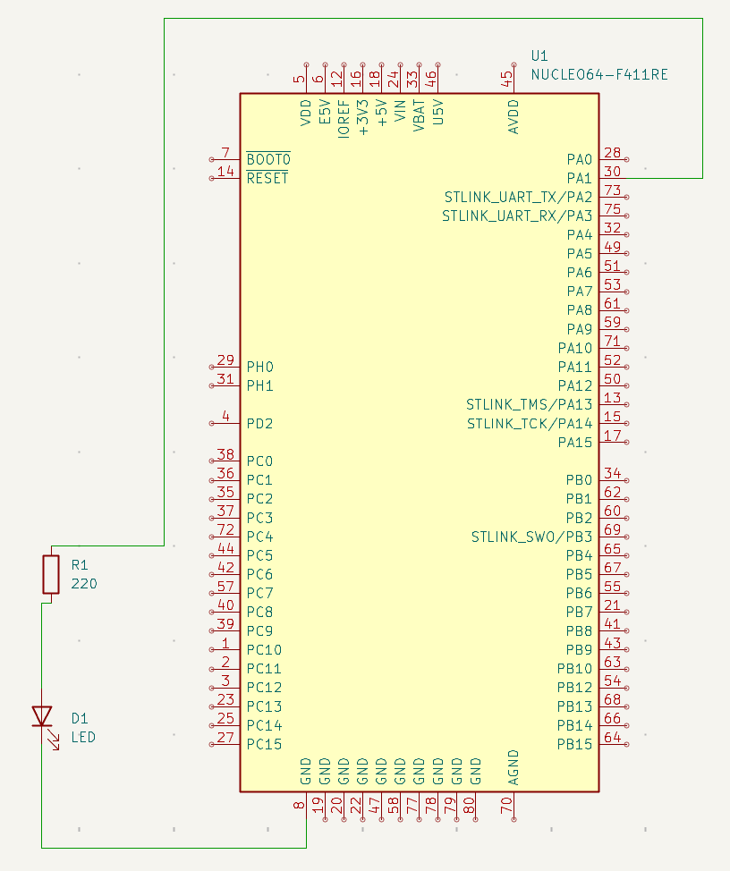
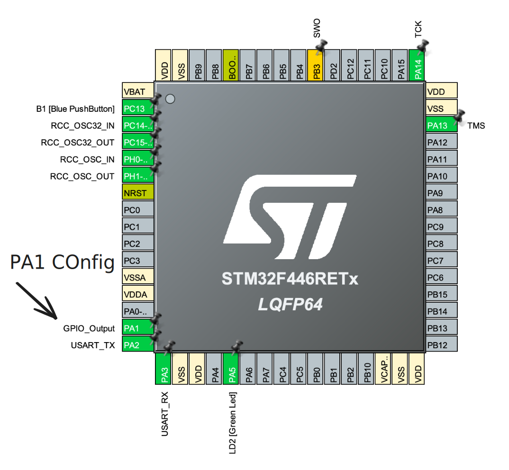

# Schema

Requirements:

- STM32F466RE (it can be any dev board)
- LED
- Resistor
- Wires



## Steps

1. Create a new project in STM32CubeIDE
2. Configure the PA1 Pin
   
3. Still in .ioc file, go to System Core and choose GPIO
4. Change PA1 to HIGH
5. In main.c write:

```c
while (1)
  {
	  HAL_GPIO_TogglePin(GPIOA, GPIO_PIN_1);
	  HAL_Delay(1000);
  }
```

6. DONE!
